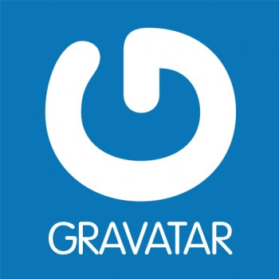

# Filament Avatar

[](https://packagist.org/packages/devaslanphp/filament-avatar)
[](https://packagist.org/packages/devaslanphp/filament-avatar)

This package provides a complete and customizable User Avatar provider for your Filament project, and also for any project using a User Model.

For now the avatar providers implemented are 

| Provider  | Website & Docs                                                                     |
|-----------|------------------------------------------------------------------------------------|
| UI Avatar | [](https://ui-avatars.com/) |
| Gravatar  | [](https://gravatar.com)     |

# Installation

You can install the package via composer:

```shell
composer require devaslanphp/filament-avatar
```

*Optionally*: You can publish the package config file:

```shell
php artisan vendor:publish --tag=filament-avatar-config
```

After you installed the package the only thing you need to do is to change the filament `default_avatar_provider` configuration to use `FilamentUserAvatarProvider` avatar provider:

```php
// ...
'default_avatar_provider' => \Devaslanphp\FilamentAvatar\Core\FilamentUserAvatarProvider::class,
// ...
```

**That's it**, Filament now will use the Avatar provider provided by this package.

# Configuration

The configuration file of this package comes like below:

```php
<?php

return [

    /*
    |--------------------------------------------------------------------------
    | DEFAULT PROVIDER
    |--------------------------------------------------------------------------
    |
    | This value is the provider to use when generating the user's avatar url
    |
    */
    'default_provider' => 'ui-avatar',

    /*
    |--------------------------------------------------------------------------
    | PROVIDERS
    |--------------------------------------------------------------------------
    |
    | This value is the definition of the different avatar providers
    |
    */
    'providers' => [
        // UI Avatar provider (https://ui-avatars.com/)
        'ui-avatar' => [
            // Class used to generate the user avatar
            'class' => \Devaslanphp\FilamentAvatar\Core\UiAvatarsProvider::class,

            // UI Avatar source url
            'url' => 'https://ui-avatars.com/api/',

            // User's field used to generate avatar
            'name_field' => 'name',

            // Color used in url text color
            'text_color' => 'FFFFFF',

            // Background color used if the 'dynamic_bg_color' flag is false
            'bg_color' => '111827',

            // If 'true' the provider will generate a dynamic 'bg_color' based on user's name
            'dynamic_bg_color' => true,

            // HSL ranges
            // You can change them as you like to adapt the dynamic background color
            'hRange' => [0, 360],
            'sRange' => [50, 75],
            'lRange' => [25, 60],
        ],

        // Gravatar provider (https://gravatar.com)
        'gravatar' => [
            // Class used to generate the user avatar
            'class' => \Devaslanphp\FilamentAvatar\Core\GravatarProvider::class,

            // Gravatar source url
            'url' => 'https://www.gravatar.com/avatar/',

            // User's field used to generate avatar
            'name_field' => 'email'
        ],
    ],

];
```

I think it's well documented, I will let you check it.

# Custom provider

If you want to add your personalized avatar provider, Follow the below steps:
1. Create a PHP class that implements a function `get(Model $user): string` (you can check `\Devaslanphp\FilamentAvatar\Core\GravatarProvider`)
2. Add a new provider to `config('filament-avatar.providers')`, with `class` parameter where you will put your custom class (you can check the configuration file to make the same)
3. Update the `config('filament.default_avatar_provider')` with your provider name

And that's it .

## Pro tip

This package can be used outside of **Filament** too, you can add the trait `Devaslanphp\FilamentAvatar\Core\HasAvatarUrl` to your user model.

This trait will give you access to an appended attribute `avatarUrl` generated by the avatar provider, then you can use it as a `src` of your images.

## Credits

- [heloufir](https://github.com/heloufir)
- [All Contributors](https://github.com/heloufir/filament-workflow-manager/graphs/contributors)

## License

The MIT License (MIT). Please see [License File](LICENSE.md) for more information.
